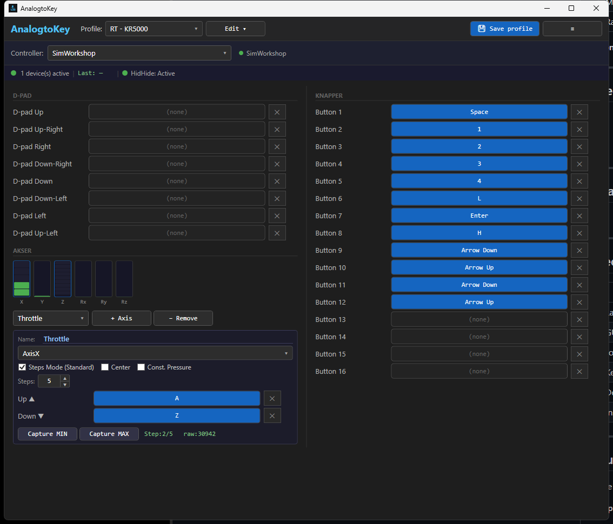

# AnalogtoKey

**Map joystick and arcade stick buttons to keyboard keys on Windows.**

AnalogtoKey reads input from USB joysticks and arcade sticks and converts every button press, D-pad direction, and axis movement into real keyboard keystrokes — exactly as if you had pressed a key on your keyboard.

## Download

➡ **[Download AnalogtoKey_Setup_v0.2_Beta.exe](https://github.com/Gallinarius/AnalogtoKey/releases/latest)**

No .NET installation required. Self-contained, runs on Windows 10 and 11 (64-bit).

---

## Screenshot

---

## Why does this exist?

Some games — such as **Running Train** — detect any connected USB controller and force it into gamepad mode, causing incorrect or doubled input. These games *do* support keyboard input correctly.

AnalogtoKey bridges the gap:
1. Hides the controllers from all other applications (via the HidHide driver)
2. Reads all input directly itself
3. Sends the correct keystrokes to the active game window

---

## Features

- Map any **button** (1–16) to any keyboard key
- Map all **8 D-pad directions** independently
- Map **analog axes** (X/Y/Z/Rx/Ry/Rz) with adjustable step count and MIN/MAX calibration
- **Multiple named profiles** — switch instantly between games
- **System tray** — runs silently in the background, always available
- **HidHide integration** — automatically hides controllers on start, restores on exit
- PDF user guide included

---

## Installation

1. Download `AnalogtoKey_Setup_v0.2_Beta.exe` from [Releases](https://github.com/Gallinarius/AnalogtoKey/releases/latest)
2. Run it (administrator rights may be required)
3. The installer offers to install the **HidHide** driver — recommended for Running Train and similar games
4. Restart Windows if HidHide was installed
5. Launch AnalogtoKey from the Start Menu or desktop shortcut

### Do I need HidHide?

| Situation | HidHide needed? |
|---|---|
| Game forces gamepad mode (e.g. Running Train) | **Yes** — without it you get double input |
| Game lets you disable controller input in its own settings | No |

HidHide is a free, open-source kernel driver. It is bundled in the installer and only needs to be installed once. AnalogtoKey manages the whitelist automatically — your controllers are restored when you exit the app.

---

## Requirements

- Windows 10 or 11 (64-bit)
- USB joystick or arcade stick
- HidHide driver (bundled in installer, optional but recommended)

---

## Hardware tested

- HORI Fighting Stick Mini (×2, simultaneous)

---

## Tech stack

| Component | Technology |
|---|---|
| Language | C# 13 / .NET 10 |
| GUI | WPF |
| Joystick input | SharpDX.DirectInput |
| Keyboard output | Windows SendInput API |
| Device hiding | HidHide (kernel driver) |
| Installer | Inno Setup 6 |

---

## License

This project is released for personal use. HidHide is developed by [Nefarius Software Solutions](https://github.com/nefarius/HidHide) and is subject to its own license.
